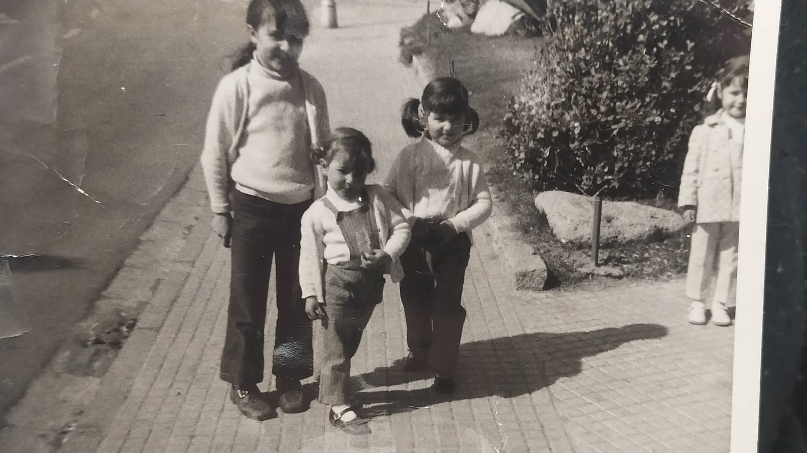
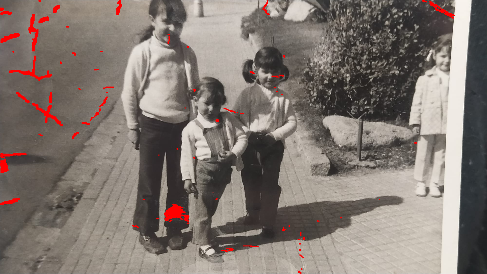
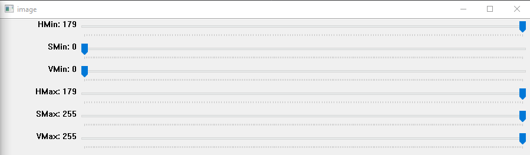
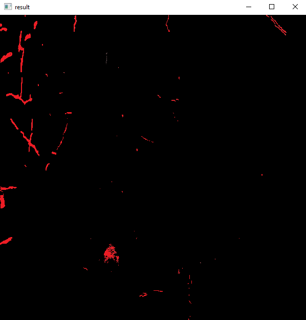
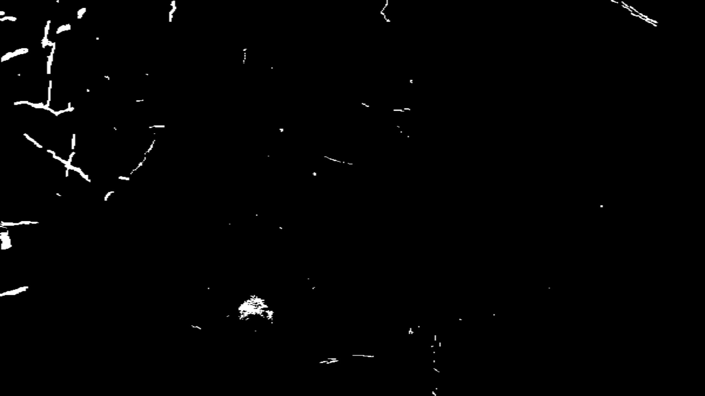

## Repairing old / broken photos from scratch with OpenCV ##

Usually, old, black and white photos are partially broken for many possible reasons (sometimes, just time itself).
OpenCV allows us to enhance them using native inpainting algorithms. I'll go step by step.

### Step 1: Pick your broken image and manually mark the broken parts to repair  ###

You can do it with any graphics editor, even MS Paint. Choose a color that will clearly distinguishable from the rest of
the image. Since we'll be generally handling black and white photos, I considered pure red color a solid choice for this purpose.

This has been my choice:

Original image:



Marked image:



As you can see, there's many cracks on the left side and a few of them in the middle of the image, including the face of the
little girl on the right side of the central trio, and also the right top corner.

### Step 2: Generate a grayscale mask using the marked image ###

In order to repair the image, we need to somehow point only the parts we want to modify. This is done through masking,
a process performed to select only specific parts of an image. Here is where using the red color is key: It's quite easy
to isolate from the rest of the photo.

To do this, we'll use a made up class called HSV_MODIFIER, since we'll use the Hue-Saturation-Value colorspace to
strip the rest of the parts of the image. We'll use a little GUI (Graphic User Interface) to do it manually in a dynamic
way. This will allow us to precisely choose the perfect values in real time, rather than test lower and upper red values
without seeing the result, until we match it.

Here's the class:

```
import cv2
import numpy as np

class HSV_MODIFIER:

    def __init__(self, path):

        self.file = path

        # Load image
        image = cv2.imread(self.file)
        original_width, original_height = image.shape[:2] # Store original width and height values. We'll need them for our output mask
        #image = cv2.resize(image, (600,600)) # We'll resize the image if it's too big for the screen

        # Create a window
        cv2.namedWindow('image')
        cv2.resizeWindow('image', 900, 500)
        # Create trackbars for color change
        # Hue is from 0-179 for Opencv, not 360
        cv2.createTrackbar('HMin', 'image', 0, 179, self.nothing)
        cv2.createTrackbar('SMin', 'image', 0, 255, self.nothing)
        cv2.createTrackbar('VMin', 'image', 0, 255, self.nothing)
        cv2.createTrackbar('HMax', 'image', 0, 179, self.nothing)
        cv2.createTrackbar('SMax', 'image', 0, 255, self.nothing)
        cv2.createTrackbar('VMax', 'image', 0, 255, self.nothing)

        # Set default value for Max HSV trackbars
        cv2.setTrackbarPos('HMax', 'image', 179)
        cv2.setTrackbarPos('SMax', 'image', 255)
        cv2.setTrackbarPos('VMax', 'image', 255)

        # Initialize HSV min/max values
        hMin = sMin = vMin = hMax = sMax = vMax = 0
        phMin = psMin = pvMin = phMax = psMax = pvMax = 0

        while(1):
            # Get current positions of all trackbars
            hMin = cv2.getTrackbarPos('HMin', 'image')
            sMin = cv2.getTrackbarPos('SMin', 'image')
            vMin = cv2.getTrackbarPos('VMin', 'image')
            hMax = cv2.getTrackbarPos('HMax', 'image')
            sMax = cv2.getTrackbarPos('SMax', 'image')
            vMax = cv2.getTrackbarPos('VMax', 'image')

            # Set minimum and maximum HSV values to display
            lower = np.array([hMin, sMin, vMin])
            upper = np.array([hMax, sMax, vMax])

            # Convert to HSV format and color threshold
            hsv = cv2.cvtColor(image, cv2.COLOR_BGR2HSV)
            mask = cv2.inRange(hsv, lower, upper)
            result = cv2.bitwise_and(image, image, mask=mask)

            # Print if there is a change in HSV value
            if((phMin != hMin) | (psMin != sMin) | (pvMin != vMin) | (phMax != hMax) | (psMax != sMax) | (pvMax != vMax) ):
                print("(hMin = %d , sMin = %d, vMin = %d), (hMax = %d , sMax = %d, vMax = %d)" % (hMin , sMin , vMin, hMax, sMax , vMax))
                phMin = hMin
                psMin = sMin
                pvMin = vMin
                phMax = hMax
                psMax = sMax
                pvMax = vMax

            # Display result image
            cv2.imshow('result', result)
            if cv2.waitKey(10) & 0xFF == ord('q'):
                break
            elif cv2.waitKey(10) & 0xFF == ord('s'):
                # Save the mask by pressing "s" on the predefined path "new_path":
                new_path = 'mask.png'
                new_img = cv2.resize(mask, (original_height, original_width))
                cv2.imwrite(new_path, new_img)
                continue

        cv2.destroyAllWindows()

    def nothing(self, x):
        pass

HSV_MODIFIER('./painted_photo.png') # Create an instance of the class pointing our image
```

This class will allow us to interactively play with HSV values and, once we've got red color isolated, just press the letter
"s" to save, not the image we are seeing, but a mask of it, in essence, a black image with our region of interest painted
in white color.

Here's how it looks:

-The trackbars values:



Since pure red is a color that "screams" a lot, I just needed to set the maximum value for minimum hue to isolate it.

-**The isolated red** with those values:



-**The exported mask** once I pressed "s" (sometimes you need to press it twice, since it checks for a key each 10 ms):




### Step 3: Apply the in-paint algorithm to remove the imperfections ###

Before going to the source code (which will be short and straight-forward), how in painting works? We'll use an inner
OpenCV algorithm called INPAINT_TELEA, <a href="https://www.olivier-augereau.com/docs/2004JGraphToolsTelea.pdf">based on this paper</a>. 

To sum up the behave of this algorithm: it calculates the new color for each of our masked pixels based on the color values
of the known neighborhood (determined by the parameter "inpaintRadius"), leveraging the weights of each surrounding pixel
according to their Euclidean distance (the further from the center pixel, the less relevant), but also giving more weight
to the pixels lying on the boundary and the boundary contours. It starts from the outside borders, and continues
iteratively to the insides of our region of interest, giving priority to the already-known pixels. 

<a href="https://docs.opencv.org/3.4/df/d3d/tutorial_py_inpainting.html">OpenCV docs</a>

**The code**

```
import cv2
import numpy as np

# Load original and mask images

original = cv2.imread('base.jpg')
mask = cv2.imread('mask.png',0)

# Apply Telea inpainting algorithm with 3x3 kernel

repaired_image = cv2.inpaint(original, mask, inpaintRadius=3, flags=cv2.INPAINT_TELEA)

# Show original image and repaired one

cv2.imshow('Original image', original)
cv2.imshow('Repaired image', repaired_image)

# Save the brand new image

cv2.imwrite('repaired.png', repaired_image)
cv2.waitKey(0)
cv2.destroyAllWindows()
```

There goes our output, compared with original image:

<div style="align-items:center; text-align:center;"> 
    <b>Original</b> <br>

</div>
<div style="align-items:center; text-align:center;"> 
    <b>Repaired</b> <br>

</div>

### Final thoughts ###

As you can see, many cracks on the road, top-right corner, little girls on the center of the photo and top-right corner are gone.
This technique could also be applied, not only to enhance broken old photos, but also, for example, to remove undesired
items in an image.